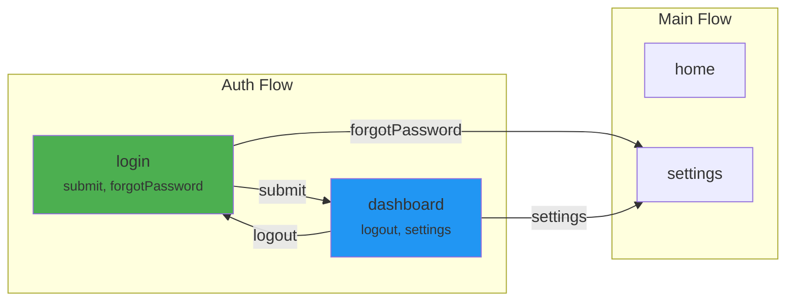

# Especificacao Tecnica - react-flow-app v2

## 1. Arquitetura

### 1.1 Visao Geral

```
@react-flow-app/
├── core          # Motor de navegacao, state management, hooks
├── diagram       # Geracao de diagramas (Mermaid, DOT, React, SVG)
├── screenshot    # Automatizacao de screenshots e visual regression
└── devtools      # Browser extension para debugging
```

### 1.2 Diagrama de Dependencias

```
                    ┌──────────────┐
                    │   devtools   │
                    └──────┬───────┘
                           │
              ┌────────────┼────────────┐
              │            │            │
      ┌───────▼──────┐  ┌─▼──────────┐ │
      │   diagram    │  │ screenshot │ │
      └───────┬──────┘  └─┬──────────┘ │
              │            │            │
              └────────┬───┘            │
                       │                │
               ┌───────▼────────┐       │
               │     core       │◄──────┘
               └────────────────┘
```

---

## 2. Package: @react-flow-app/core

### 2.1 API Publica

#### `defineScreens<T>(config)`

Factory function para definir screens com inferencia completa.

```typescript
// Signature
function defineScreens<
  TConfig extends Record<string, ScreenConfig>
>(config: TConfig): InferredScreens<TConfig>;

// Tipo do config
type ScreenConfig = {
  actions: readonly string[];
  loader: () => Promise<{ default: React.ComponentType<any> }>;
  meta?: Record<string, unknown>;  // metadata arbitraria
};

// Tipo inferido
type InferredScreens<T> = {
  [K in keyof T]: T[K] & {
    readonly name: K;
    readonly __brand: 'Screen';
  };
};
```

**Exemplo:**
```typescript
const screens = defineScreens({
  login: {
    actions: ['submit', 'forgotPassword'] as const,
    loader: () => import('./LoginScreen'),
    meta: { requiresAuth: false },
  },
  dashboard: {
    actions: ['logout', 'settings', 'profile'] as const,
    loader: () => import('./DashboardScreen'),
    meta: { requiresAuth: true },
  },
});

// Inferido:
// screens.login.actions = readonly ['submit', 'forgotPassword']
// screens.login.name = 'login'
```

---

#### `defineFlow<TScreens, TName>(config)`

Factory function para definir um flow com validacao de transicoes.

```typescript
type FlowConfig<TScreens, TName extends string> = {
  name: TName;
  baseUrl: string;
  steps: Partial<Record<keyof TScreens, StepOptions>>;
  transitions: TransitionMap<TScreens>;
};

// TransitionMap valida que:
// 1. Chaves sao steps definidos neste flow
// 2. Acoes sao acoes validas do screen correspondente
// 3. Destinos sao steps validos neste flow OU funcoes de navegacao
type TransitionMap<TScreens> = {
  [StepName in keyof TScreens]?: {
    [ActionName in InferActions<TScreens[StepName]>]?:
      | keyof TScreens                          // navegacao intra-flow
      | (() => NavigationResult)                // navegacao cross-flow
      | (() => void);                           // side effect
  };
};
```

**Exemplo:**
```typescript
const authFlow = defineFlow({
  name: 'auth',
  baseUrl: '/auth',
  steps: {
    login: {},
    dashboard: { clearHistory: true },
  },
  transitions: {
    login: {
      submit: 'dashboard',        // TS OK: 'dashboard' e step valido
      forgotPassword: () => {      // TS OK: funcao de navegacao
        return mainFlow.navigateTo('resetPassword');
      },
    },
    dashboard: {
      logout: 'login',
      settings: () => settingsFlow.navigateTo(),
      profile: 'dashboard',       // TS Error se 'profile' nao for acao de dashboard
    },
  },
});
```

---

#### `createFlowApp<TFlows>(config)`

Factory principal que cria o provider e hooks tipados.

```typescript
type FlowAppConfig<TFlows> = {
  screens: InferredScreens<any>;
  flows: TFlows;
  options?: {
    animation?: boolean | React.ReactNode;
    withUrl?: boolean;
    ssr?: boolean;
    a11y?: {
      announceStepChange?: boolean;
      manageFocus?: boolean;
    };
  };
  logger?: LoggerConfig;
};

type FlowAppOutput<TFlows> = {
  FlowProvider: React.FC<FlowProviderProps<TFlows>>;
  useFlow: <TScreen>(screen: TScreen) => UseFlowReturn<TScreen>;
  useFlowManager: () => UseFlowManagerReturn<TFlows>;
  useFlowState: () => FlowState<TFlows>;
  useFlowHistory: () => FlowHistory;
  useFlowListener: (type: ListenType, callback: ListenCallback) => void;
  useFlowDiagram: () => FlowDiagram;
  getDiagram: () => FlowDiagram;
};
```

**Exemplo:**
```typescript
const {
  FlowProvider,
  useFlow,
  useFlowManager,
  useFlowState,
  useFlowDiagram,
} = createFlowApp({
  screens,
  flows: { auth: authFlow, main: mainFlow },
  options: {
    animation: true,
    withUrl: true,
    a11y: { announceStepChange: true, manageFocus: true },
  },
});

// Tudo tipado:
// useFlowManager().start({ flowName: 'auth' })
// 'auth' e 'main' sao as unicas opcoes validas
```

---

### 2.2 State Management (useSyncExternalStore)

```typescript
// Novo FlowStore (substitui force update + refs)
class FlowStore {
  private state: FlowState;
  private listeners: Set<() => void> = new Set();

  subscribe = (callback: () => void): (() => void) => {
    this.listeners.add(callback);
    return () => this.listeners.delete(callback);
  };

  getSnapshot = (): FlowState => {
    return this.state;
  };

  getServerSnapshot = (): FlowState => {
    return this.state; // SSR safe
  };

  private emit = (): void => {
    // Imutabilidade: novo objeto a cada mudanca
    this.state = { ...this.state };
    this.listeners.forEach(fn => fn());
  };

  dispatch = (action: string, payload?: unknown): void => {
    // ... logica de dispatch
    this.emit();
  };

  back = (): void => {
    // ... logica de back
    this.emit();
  };
}
```

**Uso no React:**
```typescript
// FlowProvider internamente
const FlowProvider = ({ store, children }) => {
  const state = useSyncExternalStore(
    store.subscribe,
    store.getSnapshot,
    store.getServerSnapshot, // SSR
  );

  return (
    <FlowContext.Provider value={state}>
      {children}
    </FlowContext.Provider>
  );
};
```

---

### 2.3 Tipagem E2E - Detalhes

#### Dispatch Tipado por Screen

```typescript
// O hook useFlow recebe o screen e infere as acoes
function useFlow<TScreen extends ScreenConfig>(
  screen: TScreen
): {
  dispatch: <TAction extends TScreen['actions'][number]>(
    action: TAction,
    payload?: PayloadMap extends { [K in TAction]: infer P } ? P : Record<string, unknown>
  ) => void;
  back: () => void;
  // ...
};
```

#### Payload Tipado por Acao (Opcional)

```typescript
// Definir payloads por acao (opcional, default Record<string, unknown>)
type LoginPayloads = {
  submit: { email: string; password: string };
  forgotPassword: { email: string };
};

// Uso
const { dispatch } = useFlow<typeof screens.login, LoginPayloads>(screens.login);

dispatch('submit', { email: 'a@b.com', password: '123' });  // OK
dispatch('submit', {});                                       // TS Error
dispatch('forgotPassword', { email: 'a@b.com' });            // OK
```

#### Flow Names e Step Names Tipados

```typescript
// useFlowManager infere nomes de flows
function useFlowManager<TFlows>(): {
  start: (input: {
    flowName: keyof TFlows;
    stepName?: string;  // Idealmente tipado por flow
    options?: FlowActionOptions;
  }) => void;
  currentFlowName: keyof TFlows;
};
```

---

## 3. Package: @react-flow-app/diagram

### 3.1 API

```typescript
// Gerar diagrama a partir do FlowManager
function generateDiagram(
  fm: FlowManager | FlowAppOutput,
  options?: DiagramOptions
): DiagramOutput;

type DiagramOptions = {
  format: 'mermaid' | 'dot' | 'json' | 'react' | 'svg' | 'png';
  theme?: 'default' | 'dark' | 'minimal';
  direction?: 'LR' | 'TB' | 'RL' | 'BT';  // Left-Right, Top-Bottom, etc.
  highlightFlow?: string;      // Destacar flow especifico
  includeOptions?: boolean;    // Mostrar opcoes dos steps nos nodes
  includeActions?: boolean;    // Mostrar nomes das acoes nas edges
  groupByFlow?: boolean;       // Agrupar nodes por flow (subgraphs)
};

type DiagramOutput = {
  raw: FlowDiagram;            // Estrutura de dados
  render: string | React.FC;   // Output renderizado
  nodes: DiagramNode[];
  edges: DiagramEdge[];
};
```

### 3.2 Formato Mermaid (Output)



### 3.3 Componente React Interativo

```typescript
import { FlowDiagramView } from '@react-flow-app/diagram';

// Uso no Storybook ou docs
<FlowDiagramView
  fm={fm}
  highlightCurrent          // Destacar step atual
  interactive               // Permitir click nos nodes
  showHistory              // Mostrar caminho percorrido
  onNodeClick={(node) => {
    console.log('Clicked:', node.stepName);
  }}
  theme="dark"
  direction="TB"
/>
```

### 3.4 Extraccao do Grafo (Parser)

```typescript
// Algoritmo de extraccao
function extractGraph(fm: FlowManager): FlowDiagram {
  const nodes: DiagramNode[] = [];
  const edges: DiagramEdge[] = [];

  for (const [flowName, flow] of Object.entries(fm.flows)) {
    for (const [stepName, step] of Object.entries(flow.steps)) {
      // Criar node
      nodes.push({
        id: `${flowName}_${stepName}`,
        flowName,
        stepName,
        actions: Object.keys(step.actions),
        options: step.options,
        isInitial: stepName === flow.initialStepName,
      });

      // Criar edges a partir das acoes
      for (const [actionName, target] of Object.entries(step.actions)) {
        if (typeof target === 'string') {
          edges.push({
            from: `${flowName}_${stepName}`,
            to: `${flowName}_${target}`,
            action: actionName,
            isCrossFlow: false,
          });
        } else if (typeof target === 'function') {
          // Executar funcao para obter destino
          const result = target();
          if (result?.flowName && result?.stepName) {
            edges.push({
              from: `${flowName}_${stepName}`,
              to: `${result.flowName}_${result.stepName}`,
              action: actionName,
              isCrossFlow: result.flowName !== flowName,
            });
          }
        }
      }
    }
  }

  return { nodes, edges };
}
```

---

## 4. Package: @react-flow-app/screenshot

### 4.1 API Principal

```typescript
// Definir plano de screenshots
function defineScreenshotPlan(config: ScreenshotPlanConfig): ScreenshotPlan;

type ScreenshotPlanConfig = {
  fm: FlowManager;
  baseUrl: string;                         // URL base do Storybook/app
  outputDir?: string;                      // Default: './screenshots'
  viewports?: Viewport[];                  // Viewports para captura
  scenarios?: ScreenshotScenario[];        // Cenarios manuais
  autoDiscover?: boolean;                  // Descoberta automatica de caminhos
  maxDepth?: number;                       // Profundidade maxima (default: 15)
  waitForSelector?: string;                // Selector para esperar antes de screenshot
  waitForTimeout?: number;                 // Timeout em ms (default: 1000)
};

type Viewport = {
  name: string;
  width: number;
  height: number;
};

type ScreenshotScenario = {
  name: string;
  flow: string;
  steps: ScreenshotStep[];
};

type ScreenshotStep =
  | { step: string; screenshot: boolean; waitFor?: string }
  | { dispatch: string; payload?: Record<string, unknown> }
  | { back: true }
  | { wait: number };
```

### 4.2 Auto-Discovery de Caminhos

```typescript
// Algoritmo de enumeracao de caminhos
function discoverPaths(
  fm: FlowManager,
  options: { maxDepth: number; includeCrossFlow: boolean }
): NavigationPath[] {
  const paths: NavigationPath[] = [];
  const diagram = extractGraph(fm);

  // DFS com prevencao de ciclos
  function dfs(
    nodeId: string,
    currentPath: PathStep[],
    visited: Set<string>
  ): void {
    if (currentPath.length >= options.maxDepth) return;
    if (visited.has(nodeId)) return;

    visited.add(nodeId);
    const outEdges = diagram.edges.filter(e => e.from === nodeId);

    if (outEdges.length === 0) {
      // Folha - guardar caminho
      paths.push({ steps: [...currentPath] });
      return;
    }

    for (const edge of outEdges) {
      if (!options.includeCrossFlow && edge.isCrossFlow) continue;

      currentPath.push({
        from: nodeId,
        to: edge.to,
        action: edge.action,
      });

      dfs(edge.to, currentPath, new Set(visited));
      currentPath.pop();
    }
  }

  // Iniciar DFS a partir de todos os initial steps
  for (const node of diagram.nodes.filter(n => n.isInitial)) {
    dfs(node.id, [], new Set());
  }

  return paths;
}
```

### 4.3 Motor de Execucao (Playwright)

```typescript
// Executor de screenshots
async function executeScreenshotPlan(
  plan: ScreenshotPlan
): Promise<ScreenshotReport> {
  const browser = await playwright.chromium.launch();
  const results: ScreenshotResult[] = [];

  for (const scenario of plan.scenarios) {
    for (const viewport of plan.viewports) {
      const page = await browser.newPage({
        viewport: { width: viewport.width, height: viewport.height },
      });

      await page.goto(`${plan.baseUrl}?flow=${scenario.flow}`);

      for (const step of scenario.steps) {
        if ('screenshot' in step && step.screenshot) {
          const path = `${plan.outputDir}/${scenario.name}/${viewport.name}/${step.step}.png`;
          await page.screenshot({ path, fullPage: true });
          results.push({ path, viewport, step: step.step, scenario: scenario.name });
        }

        if ('dispatch' in step) {
          // Injetar dispatch via page.evaluate
          await page.evaluate(
            ({ action, payload }) => {
              // Aceder ao contexto React e disparar acao
              (window as any).__REACT_FLOW_APP_DISPATCH__(action, payload);
            },
            { action: step.dispatch, payload: step.payload }
          );
          await page.waitForTimeout(plan.waitForTimeout);
        }

        if ('back' in step) {
          await page.evaluate(() => {
            (window as any).__REACT_FLOW_APP_BACK__();
          });
        }
      }

      await page.close();
    }
  }

  await browser.close();

  return generateReport(results);
}
```

### 4.4 Visual Regression

```typescript
type VisualRegressionConfig = {
  baselineDir: string;         // Screenshots de referencia
  currentDir: string;          // Screenshots atuais
  diffDir: string;             // Output dos diffs
  threshold: number;           // Tolerancia (0-1, default: 0.01)
  failOnNew: boolean;          // Falhar em screenshots novos
};

async function compareScreenshots(
  config: VisualRegressionConfig
): Promise<ComparisonReport> {
  // Usar pixelmatch ou similar para comparacao pixel-a-pixel
  // Gerar diff images
  // Relatorio com pass/fail por screenshot
}
```

### 4.5 Relatorio HTML

```typescript
// Gerar relatorio visual
function generateReport(results: ScreenshotResult[]): ScreenshotReport {
  return {
    html: renderHTML(results),        // Pagina HTML navegavel
    json: results,                     // Dados raw
    summary: {
      total: results.length,
      passed: results.filter(r => r.status === 'pass').length,
      failed: results.filter(r => r.status === 'fail').length,
      new: results.filter(r => r.status === 'new').length,
    },
    diagramWithScreenshots: renderDiagramWithThumbnails(results),
  };
}
```

---

## 5. Retrocompatibilidade

### 5.1 Compatibility Layer

```typescript
// Adapter v1 -> v2
import { FlowManager as FlowManagerV1 } from 'react-flow-app';
import { createFlowApp, migrateFromV1 } from '@react-flow-app/core';

// Converter automaticamente
const v2Config = migrateFromV1(fmV1Instance);
const app = createFlowApp(v2Config);
```

### 5.2 Codemod

```bash
# Transformacao automatica do codigo
npx @react-flow-app/codemod v1-to-v2 ./src
```

O codemod transforma:
- `new FlowManager(screens)` -> `createFlowApp({ screens: defineScreens(screens) })`
- `fm.flow({...}).steps({...})` -> `defineFlow({...})`
- `useFlow(screen)` -> `useFlow(screen)` (API mantida)
- `useFlowManager()` -> `useFlowManager()` (API mantida)

---

## 6. Estrutura de Ficheiros (v2)

```
packages/core/src/
├── api/
│   ├── createFlowApp.ts
│   ├── defineFlow.ts
│   └── defineScreens.ts
├── store/
│   ├── flowStore.ts
│   └── types.ts
├── hooks/
│   ├── useFlow.ts
│   ├── useFlowManager.ts
│   ├── useFlowState.ts
│   ├── useFlowHistory.ts
│   └── useFlowListener.ts
├── components/
│   ├── FlowProvider.tsx
│   ├── StepRender.tsx
│   ├── ErrorBoundary.tsx
│   └── A11yAnnouncer.tsx
├── engine/
│   ├── navigator.ts         # Logica de navegacao (ex-Flow)
│   ├── history.ts           # Gestao de historico
│   ├── transitions.ts       # Transicoes entre steps
│   └── listeners.ts         # Sistema de eventos
├── types/
│   ├── screens.ts
│   ├── flows.ts
│   ├── hooks.ts
│   └── utils.ts
├── compat/
│   ├── v1Adapter.ts
│   └── migrateFromV1.ts
└── index.ts

packages/diagram/src/
├── parser/
│   ├── extractGraph.ts
│   └── types.ts
├── exporters/
│   ├── mermaid.ts
│   ├── dot.ts
│   ├── json.ts
│   ├── svg.ts
│   └── react/
│       ├── FlowDiagramView.tsx
│       └── DiagramNode.tsx
├── cli/
│   └── index.ts
├── storybook/
│   └── addon.ts
└── index.ts

packages/screenshot/src/
├── plan/
│   ├── defineScreenshotPlan.ts
│   └── autoDiscover.ts
├── executor/
│   ├── playwrightRunner.ts
│   └── dispatchInjector.ts
├── regression/
│   ├── compare.ts
│   └── pixelDiff.ts
├── report/
│   ├── htmlReport.ts
│   ├── jsonReport.ts
│   └── diagramReport.ts
├── ci/
│   ├── githubAction.ts
│   └── prComment.ts
└── index.ts
```

---

## 7. Requisitos Nao-Funcionais

| Requisito | Target | Metodo de Verificacao |
|-----------|--------|----------------------|
| Bundle size (core) | < 10KB gzipped | Bundlewatch CI |
| Time to first render | < 50ms | Benchmark automatizado |
| Type-check time | < 5s para 50 screens | tspc benchmark |
| Test coverage (core) | > 90% | Vitest coverage |
| Browser support | Chrome 90+, Firefox 90+, Safari 15+ | Playwright matrix |
| React support | 18.x, 19.x | CI matrix |
| SSR support | Next.js 14+, Remix | Integration tests |
| a11y score | 100 (Lighthouse) | CI audit |
| Zero runtime deps | 0 (core) | Package audit |
