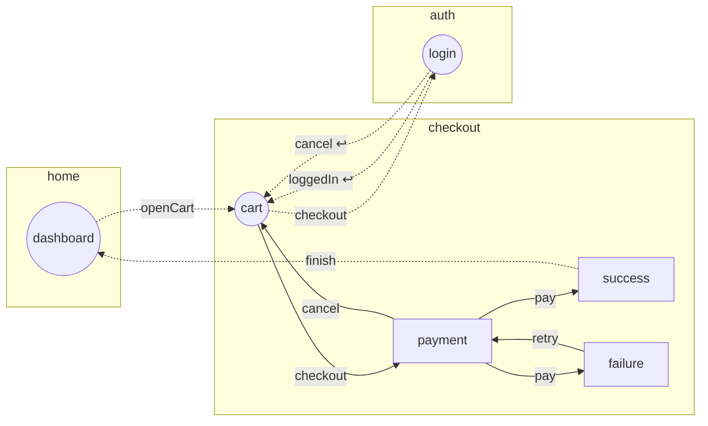

<!-- Gerado por `npm run check -- --write`. Não editar à mão. -->

# Flows

`((passo))` inicial · `{{@overlay}}` overlay · `-.->` entre flows · `↩` goto.exit() · `⟲` retoma o flow · `⚙` efeito

```mermaid
graph LR
  subgraph home
    home_dashboard((dashboard))
  end
  subgraph checkout
    checkout_cart((cart))
    checkout_payment[payment]
    checkout_success[success]
    checkout_failure[failure]
  end
  subgraph auth
    auth_login((login))
  end
  home_dashboard -.->|openCart| checkout_cart
  checkout_cart -->|checkout| checkout_payment
  checkout_cart -.->|checkout| auth_login
  checkout_payment -->|pay| checkout_success
  checkout_payment -->|pay| checkout_failure
  checkout_payment -->|cancel| checkout_cart
  checkout_success -.->|finish| home_dashboard
  checkout_failure -->|retry| checkout_payment
  auth_login -.->|loggedIn ↩| checkout_cart
  auth_login -.->|cancel ↩| checkout_cart
```
